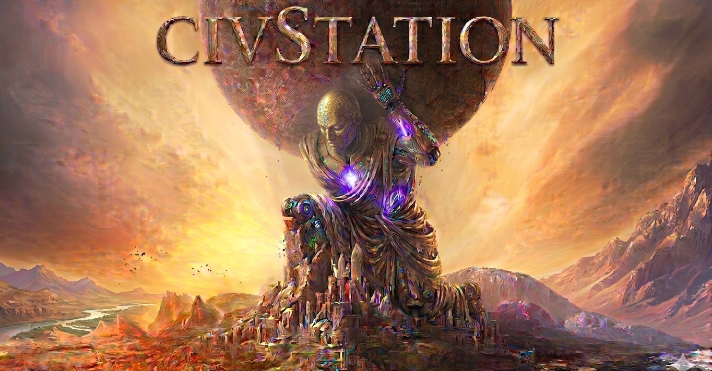
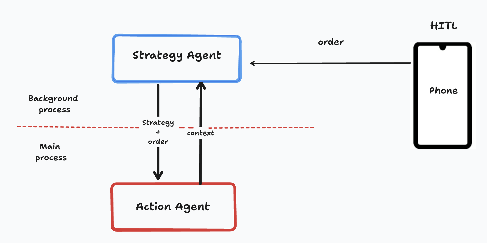

<div align="center">
  
</div>

<div align="center">

**Languages**

[English](README.md) | [한국어](README.ko.md) | [中文](README.zh.md)

</div>

# CivStation

> A controllable Civ6 computer-use stack for people who want more than "run the bot and hope."
>
> Observe the screen, refine strategy, plan the next move, and intervene live through `HitL` or `MCP`.

You can also think of CivStation as a `VLM harness` for Civilization VI: it gives a vision-language model a structured loop for observation, strategy, action planning, execution, and human override.

Canonical GitHub repository:

- `https://github.com/minsing-jin/civStation`

Current package and module names are still:

- Python package: `civStation`
- Python module: `civStation`

<a id="index"></a>
## 📚 Index

- [🚀 30-Second Quick Start](#quick-start)
- [🧭 Should I Use Docker?](#docker)
- [▶️ Recommended First-Time Run Flow](#run-flow)
- [🛠️ Permission Troubleshooting](#permission-troubleshooting)
- [📱 Mobile QR Quick Start](#mobile-qr)
- [🧠 Why HitL Matters](#hitl-matters)
- [🎮 Detailed Mobile QR Flow](#mobile-flow)
- [✨ Why CivStation?](#why-civstation)
- [🧵 Runtime Separation](#runtime-separation)
- [🏗️ Architecture](#architecture)
- [🕹️ HitL Control Surfaces](#hitl-control)
- [🧠 Backend Selection (VLM vs civ6-mcp)](#backend-selection)
- [🧩 MCP and Skill Extensibility](#mcp-skill)
- [📖 Documentation](#documentation)
- [🛠️ Development](#development)

<a id="quick-start"></a>
## 🚀 30-Second Quick Start

If the repo is already installed and you just want to see CivStation move in Civilization VI as fast as possible, do this:

> [!TIP]
> This section assumes you already cloned the repo, ran `uv sync`, prepared the local `.venv`, and exported the provider API key you plan to use.
> If this is your first setup, use `Recommended First-Time Run Flow` below.

> [!NOTE]
> Recommended starting model: `gemini-3-flash`.
> If you want one default that is fast, practical, and easy to operate for CivStation, start with `gemini-3-flash` before tuning anything else.

> [!IMPORTANT]
> Use a stable Wi-Fi connection with reliable internet from the start.
> If you use phone control or the QR flow, the phone and the desktop running Civilization VI must stay on the same Wi-Fi network.

> [!WARNING]
> The agent runs from your terminal, but before you start you must click back into the actual Civilization VI page/window so the runtime is inside the live game.
> If you use multiple monitors, keep Civ6 on the primary monitor, click the page where Civ6 is actually running to enter the runtime, and then press `Start` from your phone.

1. Open Civilization VI and stop on a playable map screen.
2. Run:

```bash
uv run civstation run \
  --provider gemini \
  --model gemini-3-flash \
  --turns 100 \
  --status-ui \
  --wait-for-start \
  --status-port 8765
```

3. Open `http://127.0.0.1:8765`
4. Press `Start`

That is the simplest possible path.
It intentionally omits `--backend`; the default remains `--backend vlm`.
Use `--backend civ6-mcp` only after completing the civ6-mcp setup below.

If you just want the setup checklist first, run:

```bash
uv run civstation
```

If macOS blocks screenshot or control access, grant:

- `Screen Recording`
- `Accessibility`

to your terminal, `uv`, or Python app, then try again.

If you run `civStation` or `civ6_tacticall` inside `tmux`, iTerm, Terminal, WezTerm, or another terminal app, make sure that terminal path also has `Screen Recording`.
If macOS shows `tmux` or `civ6_tacticall` separately in Privacy & Security, grant `Screen Recording` there too.

<a id="docker"></a>
## 🧭 Should I Use Docker?

Short answer: `no` for live gameplay.

Why:

- CivStation captures the host desktop and Civ6 window with `pyautogui` in [screen.py](/Users/jinminseong/Desktop/civStation/civStation/utils/screen.py).
- The status streamer captures the primary monitor directly with `mss` in [screen_streamer.py](/Users/jinminseong/Desktop/civStation/civStation/agent/modules/hitl/status_ui/screen_streamer.py).
- The runtime also needs host-level `Screen Recording` and `Accessibility` permissions on macOS.
- For actual play, the agent must see and click the real Civ6 window on the same machine and desktop session.

That means Docker is the wrong default for:

- live Civ6 play
- local screen capture
- mouse/keyboard control
- the mobile-control flow where the host machine is also running the game

Docker is only reasonable here for non-GUI tasks such as:

- docs builds
- linting
- tests that do not need the real game window

<a id="run-flow"></a>
## ▶️ Recommended First-Time Run Flow

If you cloned the repo and want to run CivStation correctly:

1. Clone and enter the repo.

```bash
git clone https://github.com/minsing-jin/civStation.git
cd civStation
```

2. Create or sync the local virtual environment.

```bash
uv sync
```

`uv sync` creates or updates the repo-local `.venv`.
`uv run ...` works without activation, but if you want to enter it directly:

```bash
source .venv/bin/activate
```

3. Export the provider key you actually plan to use. For the `gemini` command below:

```bash
export GENAI_API_KEY=...
```

4. Print the operator guide first.

```bash
uv run civstation
```

5. Put Civ6 on the main monitor and leave the actual game screen visible.
6. If you want remote control, keep the dashboard off the game screen and use your phone or a secondary device.
7. Start the agent.

```bash
uv run civstation run \
  --provider gemini \
  --model gemini-3-flash \
  --turns 100 \
  --status-ui \
  --wait-for-start \
  --status-port 8765
```

8. Open `http://127.0.0.1:8765` and press `Start`.

Installed command aliases also work:

```bash
civstation
civstation run --provider gemini --model gemini-3-flash --turns 100 --status-ui --wait-for-start
```

<a id="permission-troubleshooting"></a>
## 🛠️ Permission Troubleshooting

If screenshots are black, stale, or never update on macOS:

1. Grant `Screen Recording` to the terminal app that launched `civStation` or `civ6_tacticall`.
2. If you launched them from `tmux`, check whether `tmux` or `civ6_tacticall` also appears in Privacy & Security and grant `Screen Recording` there too.
3. Grant `Accessibility` to the app path that sends input back to Civ6.
4. Fully quit and relaunch the terminal app, the `tmux` session, and the running agent after changing permissions.

<a id="mobile-qr"></a>
## 📱 Mobile QR Quick Start

If you want to control the run from your phone:

> [!IMPORTANT]
> Use a stable Wi-Fi connection with reliable internet.
> The phone and the desktop running Civilization VI must stay on the same Wi-Fi network for pairing and control to work reliably.
> The agent still runs from your terminal, so before you press `Start` on your phone, click back into the live Civ6 page/window to enter the runtime.
> If you use multiple monitors, keep Civ6 on the primary monitor and leave the live game page focused.

1. Clone and start the mobile controller:

```bash
git clone https://github.com/minsing-jin/civ6_tacticall.git
cd civ6_tacticall
npm install
npm start
```

2. Create the bridge config:

```bash
cp host-config.example.json host-config.json
```

3. Put CivStation's local server into the config:

```json
{
  "relayUrl": "ws://127.0.0.1:8787/ws",
  "localApiBaseUrl": "http://127.0.0.1:8765",
  "localAgentUrl": "ws://127.0.0.1:8765/ws",
  "roomId": "civ6-room",
  "hostKey": "change-this-host-key"
}
```

4. Start the bridge:

```bash
npm run host
```

5. Scan the QR code with your phone
6. Press `Start` on your phone

That `Start` signal is what actually begins gameplay.

<a id="hitl-matters"></a>
## 🧠 Why HitL Matters

> [!IMPORTANT]
> CivStation is **not** a fully autonomous agent today.
> If you do not use `HitL`, the agent can get noticeably dumber in real play.

Why:

- screen state can be ambiguous
- long-term intent can drift
- unexpected Civ6 UI states still happen
- a human is still the fastest recovery mechanism

In practice, HitL makes the agent:

- less brittle
- easier to recover
- more aligned with the goal you actually want

The easiest beginner setup is:

- local dashboard first
- mobile QR second
- full MCP automation later

<a id="mobile-flow"></a>
## 🎮 Detailed Mobile QR Flow

### Relationship

```text
Civilization VI game window
  <- screen capture + action execution -> CivStation
  <- local WebSocket/API bridge -> civ6_tacticall
  <- remote mobile UI -> phone browser via QR
```

### End-to-end control flow

```text
Phone / Browser
  -> civ6_tacticall controller
  -> civ6_tacticall relay
  -> bridge.js on host
  -> CivStation WebSocket/API
  -> AgentGate / CommandQueue / Discussion API
  -> Civ6 gameplay
```

### What `start` actually does

```text
Controller Start button
  -> WebSocket control:start
  -> bridge.js
  -> ws://127.0.0.1:8765/ws
  -> AgentGate.start()
  -> turn_runner exits wait state
  -> turn_executor begins playing turns
```

### Recommended operator setup

- Keep Civ6 on the main display and visible at all times.
- Do not cover the game window with the local controller UI.
- Prefer controlling from a phone or secondary device.
- Pair the mobile browser by scanning the QR code printed by `npm run host`.
- Use windowed or borderless mode if you want reliable automatic game-window cropping on macOS.
- Keep the game at a stable resolution during a run.

<a id="why-civstation"></a>
## ✨ Why CivStation?

- `Layered by design`: the agent is broken into inspectable layers instead of one opaque loop.
- `Human-steerable`: pause, resume, stop, change strategy, and discuss the next move while the run is live.
- `MCP-first`: the same architecture is exposed as a stable external control surface.
- `Real runtime separation`: context/strategy work, main-thread action work, and HITL control are split into different runtime lanes.
- `Extensible`: swap adapters, add skills, and change orchestration without rewriting the whole system.
- `Operator-friendly`: local dashboard, WebSocket control, and remote phone control are all supported.
- `A practical VLM harness`: instead of calling a VLM on raw screenshots ad hoc, CivStation wraps the model in a reusable control loop with context, routing, planning, execution, and intervention points.

<a id="runtime-separation"></a>
## 🧵 Runtime Separation

The MCP session/runtime model matters because it mirrors the real execution split:

- `background runtime`
  - context observation and turn tracking
  - strategy refresh and background reasoning
- `main-thread action runtime`
  - route the current screen
  - plan the primitive action
  - execute the action safely on the game window
- `hitl runtime`
  - external controller, dashboard, relay, or mobile client
  - sends lifecycle and strategy/control directives into the running system

This is the core value of the layered runtime:

- expensive background reasoning does not have to block the action loop
- the action loop stays deterministic and interruptible
- HITL stays outside the action thread, but can still steer it safely through queues and gates
- MCP sessions become real runtime containers instead of just serialized state blobs

<a id="architecture"></a>
## 🏗️ Architecture

### The Four Layers

<div align="center">
  
</div>

| Layer | Core question | Main code | Details |
|---|---|---|---|
| `Context` | What is on the screen and what is the current game state? | `civStation/agent/modules/context/` | [Context README](civStation/agent/modules/context/README.md) |
| `Strategy` | Given the state and human intent, what should matter next? | `civStation/agent/modules/strategy/` | [Strategy README](civStation/agent/modules/strategy/README.md) |
| `Action` | Which primitive should handle this screen, and what action should it take? | `civStation/agent/modules/router/`, `civStation/agent/modules/primitive/` | [Router README](civStation/agent/modules/router/README.md), [Primitive README](civStation/agent/modules/primitive/README.md) |
| `HitL` | How can a human intervene while the agent is running? | `civStation/agent/modules/hitl/` | [HitL README](civStation/agent/modules/hitl/README.md) |

### Folder Mapping

Yes, the abstractions now map directly to folders.

- `Context` lives in `civStation/agent/modules/context/`
- `Strategy` lives in `civStation/agent/modules/strategy/`
- `HitL` lives in `civStation/agent/modules/hitl/`
- `Action` is the one deliberate split:
  it lives across `civStation/agent/modules/router/` and `civStation/agent/modules/primitive/`

That split is intentional: routing and primitive execution are separate responsibilities.

### High-Level Flow

```text
Screenshot
  -> Context
  -> Strategy
  -> Action
  -> Execution

Human-in-the-Loop can intervene at:
  - lifecycle: start / pause / resume / stop
  - strategy: high-level intent change
  - action: primitive override / direct command
```

<a id="hitl-control"></a>
## 🕹️ HitL Control Surfaces

### Local dashboard

- `http://127.0.0.1:8765`
- `POST /api/agent/start`
- `POST /api/agent/pause`
- `POST /api/agent/resume`
- `POST /api/agent/stop`
- `POST /api/directive`
- `POST /api/discuss`

### WebSocket

```text
ws://127.0.0.1:8765/ws
```

Supported messages:

```json
{ "type": "control", "action": "start" }
{ "type": "control", "action": "pause" }
{ "type": "control", "action": "resume" }
{ "type": "control", "action": "stop" }
{ "type": "command", "content": "Switch to culture victory and stop expanding" }
```

### Remote controller

- [`minsing-jin/civ6_tacticall`](https://github.com/minsing-jin/civ6_tacticall.git)
- mobile QR controller + relay + bridge

<a id="backend-selection"></a>
## 🧠 Backend Selection (VLM vs civ6-mcp)

CivStation can be driven by one of two completely separate action backends.
This is **not** a fallback chain — it's a clean, mutually-exclusive split
selected at startup with the `--backend` flag.

Accepted values are `--backend vlm` and `--backend civ6-mcp`.
If `--backend` is omitted, CivStation uses `vlm`.
The startup contract is:

```bash
civstation run --backend {vlm,civ6-mcp}
```

At runtime, only the selected backend is initialized. Choosing `vlm` keeps the
run entirely on the VLM/computer-use path; CivStation will not launch, call, or
retry through `civ6-mcp` as a fallback if VLM observation, routing, or action
execution fails.
Choosing `civ6-mcp` disables the VLM stack instead of falling back to it. If a
run tries to combine VLM components such as screenshot observation, primitive
routing, or pyautogui execution with a civ6-mcp client, the runtime treats that
as a configuration error and raises `BackendRuntimeConflictError`.

### `vlm` (default)

The original pipeline, unchanged.
- Capture screenshots and analyze them with a VLM / computer-use model.
- Route to one of 14 primitives → click / drag / keypress.
- Requires macOS Screen Recording / Accessibility permissions.

```bash
uv run civstation run --backend vlm --provider gemini --model gemini-3-flash --turns 100
```

### `civ6-mcp` (additive, new)

Drive Civ6 directly through the upstream
[lmwilki/civ6-mcp](https://github.com/lmwilki/civ6-mcp) MCP server, which
talks to the game over the FireTuner protocol.

This mode does not use screenshots, pixel routing, or pyautogui actions.
CivStation starts the upstream server as a stdio JSON-RPC subprocess and talks
to it through the Python `mcp` SDK.

**Prerequisites**:

1. Civilization VI (Steam) with the Gathering Storm DLC installed.
2. A singleplayer game loaded and FireTuner enabled.
3. `uv` available on `PATH` for the recommended launcher.
4. A local checkout of `github.com/lmwilki/civ6-mcp`.

**1. Enable FireTuner for Civ6**

Edit Civilization VI's `AppOptions.txt` and set:

```text
EnableTuner 1
```

Common locations:

- macOS: `~/Library/Application Support/Sid Meier's Civilization VI/AppOptions.txt`
- Linux/Proton: the Civ6 prefix or compatibility-data directory containing `AppOptions.txt`
- Windows: install "Sid Meier's Civilization VI SDK" from Steam Tools, then enable tuner support for the local game install

Restart Civ6 after changing this setting, then load a singleplayer Gathering
Storm game. FireTuner disables Steam achievements while active. Close any
separate `FireTuner.exe` or `FireTuner.app` session before launching CivStation
because only one client can own the FireTuner connection.

**2. Install the upstream `civ6-mcp` server**

```bash
git clone https://github.com/lmwilki/civ6-mcp ~/civ6-mcp
cd ~/civ6-mcp
uv sync
```

Optional smoke test from that checkout:

```bash
uv run civ-mcp
```

The command should start the stdio MCP server and then wait for JSON-RPC input.
Stop it with `Ctrl+C`; CivStation will launch it automatically during a real run.

**3. Run CivStation with the `civ6-mcp` backend**

Either export the upstream checkout path:

```bash
export CIV6_MCP_PATH="$HOME/civ6-mcp"
```

or pass it explicitly:

```bash
uv run civstation run \
  --backend civ6-mcp \
  --civ6-mcp-path "$HOME/civ6-mcp" \
  --civ6-mcp-launcher uv \
  --provider gemini \
  --model gemini-3-flash \
  --strategy "Science victory. Campus first. Four cities. Avoid wars." \
  --turns 100 \
  --status-ui \
  --wait-for-start \
  --status-port 8765
```

`--civ6-mcp-path` defaults to `$CIV6_MCP_PATH` and then `~/civ6-mcp`.
`--civ6-mcp-launcher uv` runs:

```bash
uv run --directory <civ6-mcp-path> civ-mcp
```

If you prefer to activate the upstream checkout's virtual environment yourself,
use `--civ6-mcp-launcher python`; CivStation will run `python -m civ_mcp`.

**Usage notes**:

- Keep Civ6 open on the loaded singleplayer game before pressing `Start`.
- `civstation mcp` is CivStation's layered extension server; it is not the upstream `civ6-mcp` action backend.
- `--provider` and `--model` still select the planner LLM, but no VLM router is initialized.
- Do not pass civ6-mcp launch options to a `vlm` run, and do not expect VLM screenshot routing or pyautogui recovery inside a `civ6-mcp` run. The two backend component sets are mutually exclusive.
- `--status-ui` remains useful for start/stop, phase display, and human control. If you rely on live screen streaming in that UI, host screen-capture permissions may still apply even though the `civ6-mcp` backend itself does not read pixels.
- Use `--backend vlm` or omit `--backend` to return to the original screenshot/computer-use pipeline.

| Aspect | `vlm` | `civ6-mcp` |
|---|---|---|
| Input | PIL screenshots | game-internal state via tool calls |
| Routing | 14 primitives | none; planner picks tools directly |
| Execution | pyautogui click / keypress | civ6-mcp tools (`set_research`, `unit_action`, `end_turn`, etc.) |
| Backend permissions | Screen Recording + Accessibility | FireTuner localhost connection |
| Multiplayer | works | **not supported** (FireTuner is singleplayer-only) |
| Achievements | unaffected | **disabled** |

### Caveats

- Singleplayer + Gathering Storm DLC required.
- Window position / monitor layout is irrelevant for `civ6-mcp` — the agent
  never reads pixels.
- Close any other `FireTuner.exe`/`FireTuner.app` first; the protocol allows
  only one connection at a time.
- A handful of in-game flows (era dedication, ad-hoc event popups) aren't
  exposed by upstream civ6-mcp yet; we'll continue to harden coverage.

<a id="mcp-skill"></a>
## 🧩 MCP and Skill Extensibility

### MCP

This repository exposes the same architecture through a layered MCP server so the Civ agent can be reused as a portable capability instead of only as an internal code path.

Tool groups:

- `context_*`
- `strategy_*`
- `action_*`
- `hitl_*`
- `workflow_*`
- `session_*`

Run it with:

```bash
uv run civstation mcp
```

or install the console script and run:

```bash
civStation_mcp
```

For remote or hosted MCP clients:

```bash
uv run civstation mcp \
  --transport streamable-http \
  --host 127.0.0.1 \
  --port 8000 \
  --streamable-http-path /mcp \
  --json-response \
  --stateless-http
```

Docs:

- [MCP README](civStation/mcp/README.md)
- [Layered MCP Tool Map](docs/layered_mcp.md)

### Strict Layer Separation

The MCP contract preserves the runtime split used by the project:

- `strategy/context`: background-oriented
- `primitive action`: main-thread oriented
- `hitl`: external queue / relay oriented

This separation is exposed as a portable contract through tools, resources, and prompts rather than through host-specific wrapper logic.

### Adapter extensibility

The MCP runtime is still adapter-driven inside those layer boundaries.

Default extension slots:

- `action_router`
- `action_planner`
- `context_observer`
- `strategy_refiner`
- `action_executor`

You can register adapters in `LayerAdapterRegistry` and select them per session through `adapter_overrides`.

### Portable host setup

This repo ships host templates and an installer instead of hard-wiring one host's local skill/config folder into the repository.

Templates:

- `templates/clients/codex/`
- `templates/clients/claude-code/`

Installer:

```bash
uv run civstation mcp-install --client codex --write
uv run civstation mcp-install --client claude-code --write
```

Setup resources exposed by MCP:

- `civ6://install/codex-config`
- `civ6://install/claude-code-project-mcp-json`
- `civ6://install/http-client-example`
- `civ6://contracts/layers`

### Safety defaults

Live action execution is disabled by default.

- default session runtime: `execution_mode="dry_run"`
- live execution requires `session_config_update(... execution_mode="live")`
- if confirmation is enabled, callers must also pass `confirm_execute=true`

That keeps the MCP surface safe for new users while still allowing real execution when explicitly unlocked.

<a id="documentation"></a>
## 📖 Documentation

Hosted docs:

- `https://minsing-jin.github.io/civStation/`

Local docs:

- `make docs-serve`
- `make docs-build`

Detailed layer docs:

- [Context README](civStation/agent/modules/context/README.md)
- [Strategy README](civStation/agent/modules/strategy/README.md)
- [Router README](civStation/agent/modules/router/README.md)
- [Primitive README](civStation/agent/modules/primitive/README.md)
- [HitL README](civStation/agent/modules/hitl/README.md)
- [MCP README](civStation/mcp/README.md)

Other languages:

- [한국어](README.ko.md)
- [中文](README.zh.md)

<a id="development"></a>
## 🛠️ Development

```bash
make lint
make format
make check
make test
make coverage
```
